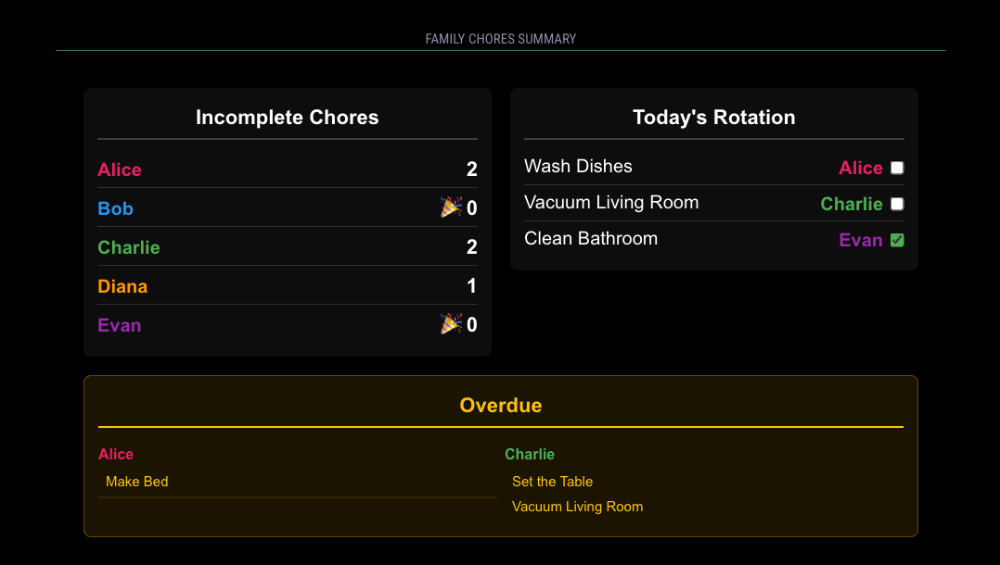
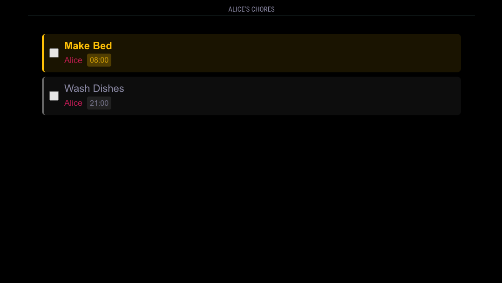
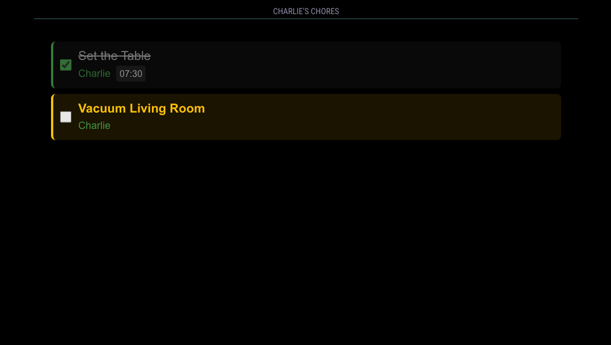
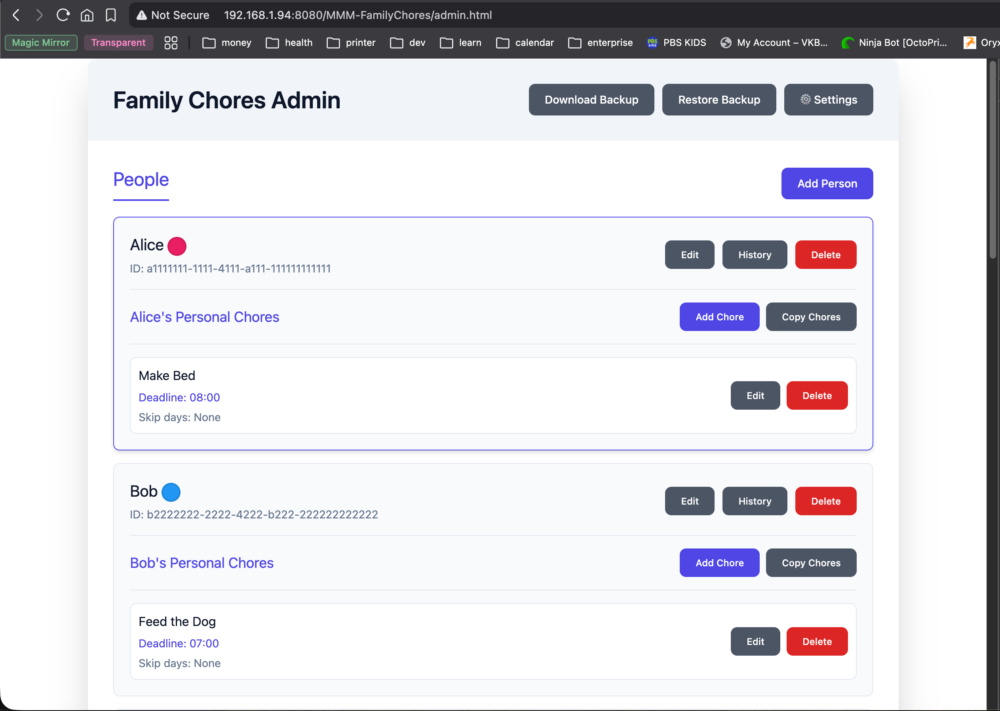
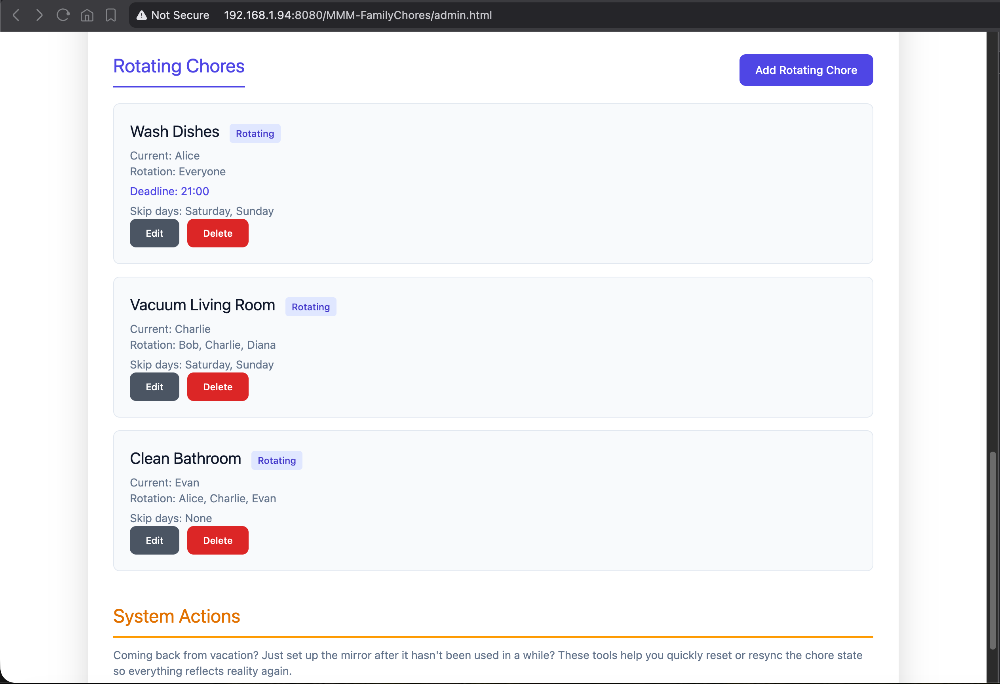
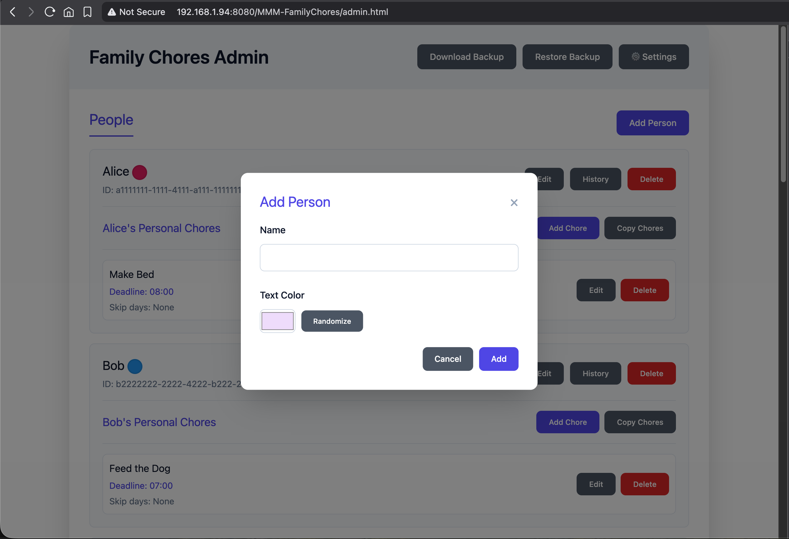
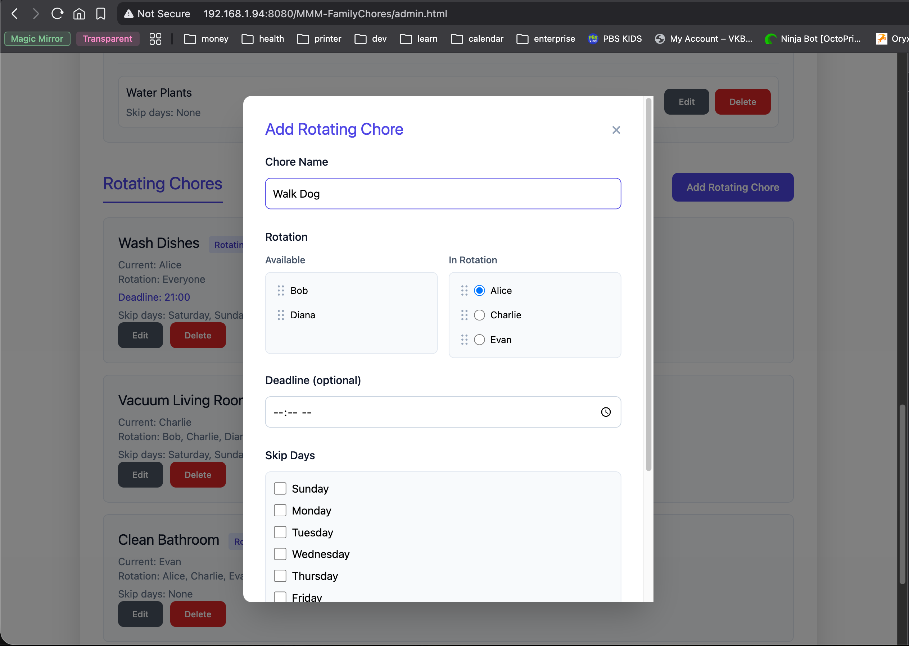
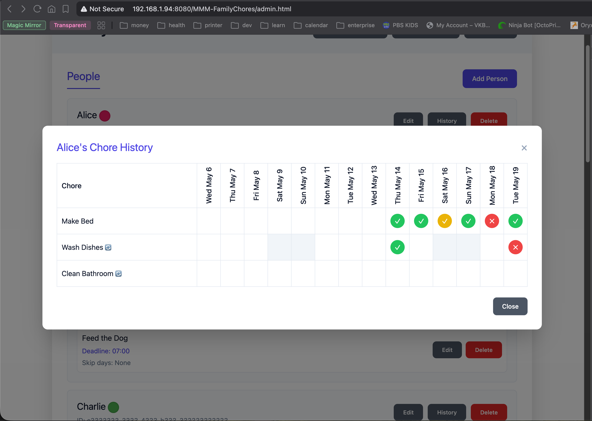

# MMM-FamilyChores

A MagicMirror² module for family chore tracking with personal daily chores, rotating chores that stay with one family member per day and cycle to the next when marked complete, a configurable summary view, and a full-featured admin panel.



## Current Features

- **Interactive Checkbox List**: Click checkboxes to mark chores complete/incomplete with immediate visual feedback
- **Personal Chores**: Daily tasks assigned to specific family members that reset at midnight
- **Rotating Chores**: Shared tasks that cycle through family members when completed
- **Flexible Display**: Per-person views or configurable summary view showing all incomplete chores
- **Visual Indicators**: Color-coded person names, deadline badges, and completion styling
- **Real-time Updates**: Changes sync immediately between frontend and backend via socket notifications
- **Configurable Summary View**: Show all incomplete chores, rotating assignments, and behind schedule sections with customizable visibility
- **Skip Days**: Configure chores to skip specific days (e.g., weekends)
- **State Persistence**: Single JSON file stores all configuration and current state
- **Admin Panel**: Web-based UI for managing people, chores, settings, and viewing activity history
- **PIN Protection**: Optional admin PIN with enable/disable toggle — view everything in the admin panel without it, but any change (add, edit, delete, settings, backup download/restore) requires it
- **Activity History**: Per-person 2-week chore history — see which chores were completed each day, and whether they were on time or late (for chores with deadlines)
- **Backup/Restore**: Download and upload configuration files

## Planned Roadmap

_Note: This roadmap represents current plans and priorities. Features may be added, removed, or modified based on user feedback and development considerations._

None at this time. The module is feature-complete for v1.0.

We welcome suggestions, but aim to preserve the module's focus on simple family chore tracking. Not every feature will fit — see [Intentionally _Not_ Included](#intentionally-_not_-included) for examples of what we intentionally keep out of scope to avoid "kitchen sink" bloat.

Have an idea? Start a discussion in the [GitHub Discussions](https://github.com/jonyo/MMM-FamilyChores/discussions) section.

## Intentionally _Not_ Included

- **Advanced Scheduling**: This module focuses on daily chores with basic features like skip days. For complex scheduling needs, consider using this alongside a calendar module for the more complex "every other Monday" or "monthly" chores.

- **Reward System**: Focused on simple chore tracking rather than gamification. Provides visual indicators for overdue tasks and tracks completion history for reference, but does not award rewards or points. Designed as a straightforward reminder system with rotating chore assignments. Any "rewards" or incentives are left to the family to implement outside the system.

- **Security**: Designed for private home environments only. The PIN protection provides minimal deterrence but stores PIN in plain text. Not suitable for public/shared environments. Person and chore names (and similar fields) are stored exactly as entered; the mirror UI and bundled admin page escape them when building HTML so markup in names is shown as text, not executed. This does not replace network-level controls (keep MagicMirror off the public internet; treat your LAN as the trust boundary). See [Security & Privacy](#security--privacy) for what the module does and does not do regarding external connectivity.

## Installation

1. Clone this repository into your MagicMirror modules folder:

   ```bash
   cd ~/MagicMirror/modules
   git clone https://github.com/jonyo/MMM-FamilyChores.git
   ```

2. Add at least one module entry to your MagicMirror `config.js` — MagicMirror won't load the module (and the admin panel won't work) until there is at least one entry. See the [Configuration](#configuration) section for the minimal setup and all available options.

3. Once MagicMirror is running, open the admin panel in your browser to set up people and chores:

   ```
   http://192.168.xxx.xxx:8080/MMM-FamilyChores/admin.html
   ```

   Replace `192.168.xxx.xxx` with the IP address of your MagicMirror device.

   To access the admin panel from another device, you may need to adjust your `address` and `ipWhitelist` settings in MagicMirror's `config.js`. See the [MagicMirror configuration docs](https://docs.magicmirror.builders/configuration/introduction.html) for details.

That's it! The module includes all necessary dependencies in the bundled JavaScript files.

## Update

To update the module to the latest version:

```bash
cd ~/MagicMirror/modules/MMM-FamilyChores
git pull
```

No additional steps are needed - the bundled JavaScript files are included in the repository.

**Before updating**, check [CHANGELOG.md](CHANGELOG.md) for version history and release notes. We strive to maintain backward compatibility, but any breaking changes will be clearly documented there.

## Configuration

### Basic Options

| Option          | Type    | Default       | Description                                     |
| --------------- | ------- | ------------- | ----------------------------------------------- |
| `personFilter`  | string  | `null`        | Filter chores by person name (case-insensitive) |
| `viewMode`      | string  | `'personal'`  | View mode: `'personal'` or `'summary'`          |
| `summary`       | object  | see below     | Summary view configuration options              |

### Summary View Configuration

When `viewMode` is set to `'summary'`, you can control which sections are displayed using the `summary` configuration object:

| Option            | Type    | Default                          | Description                               |
| ----------------- | ------- | -------------------------------- | ----------------------------------------- |
| `showIncomplete`  | boolean | `true`                           | Show incomplete chores section            |
| `showRotating`    | boolean | `true`                           | Show current rotating assignments section |
| `showOverdue`     | boolean | `true`                           | Show overdue chores section               |
| `incompleteTitle` | string  | `'Incomplete Chores'`            | Custom title for incomplete section       |
| `rotatingTitle`   | string  | `"Today's Rotation"`             | Custom title for rotating section         |
| `overdueTitle`    | string  | `'Overdue'`                      | Custom title for overdue section          |

#### Summary View Example

```javascript
{
  module: 'MMM-FamilyChores',
  position: 'middle_center',
  header: 'Family Chores Summary',
  config: {
    viewMode: 'summary',
    summary: {
      showIncomplete: true,    // Show "Incomplete Chores" section
      showRotating: true,     // Show "Today's Rotation" section
      showOverdue: true       // Show "Behind Schedule" section
    }
  }
}
```

#### Custom Summary View Examples

**Only show rotating assignments:**

```javascript
config: {
  viewMode: 'summary',
  summary: {
    showIncomplete: false,
    showRotating: true,
    showOverdue: false
  }
}
```

**Hide overdue section (less cluttered):**

```javascript
config: {
  viewMode: 'summary',
  summary: {
    showIncomplete: true,
    showRotating: true,
    showOverdue: false
  }
}
```

**Custom section titles:**

```javascript
config: {
  viewMode: 'summary',
  summary: {
    showIncomplete: true,
    showRotating: true,
    showOverdue: true,
    incompleteTitle: 'To Do Today',
    rotatingTitle: 'Weekly Rotation',
    overdueTitle: 'Past Due'
  }
}
```

**Split summary sections across the mirror:**

Use multiple module instances to place each summary section in a different position:

```javascript
// Incomplete chores in the top left
{
  module: 'MMM-FamilyChores',
  position: 'top_left',
  header: 'To Do',
  config: {
    viewMode: 'summary',
    summary: {
      showIncomplete: true,
      showRotating: false,
      showOverdue: false
    }
  }
},
// Rotating assignments in the top right
{
  module: 'MMM-FamilyChores',
  position: 'top_right',
  header: 'Rotating',
  config: {
    viewMode: 'summary',
    summary: {
      showIncomplete: false,
      showRotating: true,
      showOverdue: false
    }
  }
}
```

### Display Modes

> Screenshots below show representative examples of the module's appearance. The mirror display is fully customizable through your MagicMirror `custom.css` file, so your actual layout may differ. Even with default options, the look may change depending on which region you add the module to.

#### Per-Person View

Show only one person's personal chores plus their current rotating assignments:

```javascript
{
  module: 'MMM-FamilyChores',
  position: 'middle_center',
  header: "Alice's Chores",
  config: { personFilter: 'Alice' }
}
```



**Overdue indicator** — chores not completed by their deadline or not marked complete the previous day show with a yellow warning badge:



#### Summary View

Show all incomplete chores, rotating assignments, and behind schedule chores in organized sections with a compact, space-efficient layout:

- **Incomplete Chores**: Displays each person with their count of incomplete tasks (includes both personal and rotating chores assigned to them). People with 0 incomplete chores show a celebration emoji (🎉).
- **Today's Rotation**: Shows rotating chores in a compact inline format with chore name, assigned person, and checkbox on each line.
- **Overdue**: Groups overdue chores by person, showing the person name followed by up to 3 overdue chore names. If a person has more than 4 overdue chores, displays "...X more" after the first 3. A chore shows as overdue either because its deadline has passed today or because it was not completed the previous day (even if no deadline is set).
- All 3 options respect the skip days and skip visibility settings.

Sections automatically arrange side-by-side when there's horizontal space, or stack vertically depending on what position is used in the config.

```javascript
{
  module: 'MMM-FamilyChores',
  position: 'middle_center',
  header: 'Family Chores Summary',
  config: {
    viewMode: 'summary'
  }
}
```


#### All Chores View

Show all incomplete chores and rotating assignments (default behavior when no personFilter is specified):

```javascript
{
  module: 'MMM-FamilyChores',
  position: 'middle_center',
  header: 'Family Chores'
  // No personFilter means show all chores
}
```

#### Multiple Views

Use multiple module instances for different views on separate pages:

```javascript
// Alice gets her own page
{
  module: 'MMM-FamilyChores',
  position: 'middle_center',
  header: "Alice's Chores",
  config: { personFilter: 'Alice' },
  classes: 'alice-page'
},
// Bob gets his own page
{
  module: 'MMM-FamilyChores',
  position: 'middle_center',
  header: "Bob's Chores",
  config: { personFilter: 'Bob' },
  classes: 'bob-page'
},
// Summary page shows all chores in organized sections
{
  module: 'MMM-FamilyChores',
  position: 'middle_center',
  header: 'Family Summary',
  config: { viewMode: 'summary' },
  classes: 'summary-page'
}
```

#### MMM-pages Integration

To set up per-person pages with [MMM-pages](https://github.com/edward-shen/MMM-pages), add the `classes` property to each module instance and configure MMM-pages to cycle through them:

```javascript
{
  module: 'MMM-pages',
  config: {
    // Cycles through alice-page, bob-page, summary-page
    modules: [
      ['alice-page'],
      ['bob-page'],
      ['summary-page']
    ],
    // Optional: navigation module
    fixed: ['MMM-page-indicator']
  }
}
```

Each module instance only needs `classes` (not `pages` in the MMM-pages array). This keeps your MMM-pages config clean and lets you control page membership from the module itself.

## Usage

### Interactive Checkbox Interface

The module provides an intuitive checkbox interface for managing chores:

- **Check the box** to mark a chore as complete
- **Uncheck the box** to mark a chore as incomplete (undo completion)
- **Visual feedback**: Completed chores show with strikethrough text and reduced opacity
- **Real-time updates**: Changes are saved immediately and reflected across all module instances

### Chore Display

Each chore item shows:

- **Chore name** (with strikethrough when completed)
- **Assigned person** with their color-coded name
- **Deadline badge** (if configured)
- **Checkbox** for marking complete/incomplete

### State Management

- **Daily reset**: All `completedToday` flags clear at midnight
- **Rotating chores**: Advance to next person only when marked complete
- **Persistent storage**: All changes saved to `data.json` immediately

## Admin Panel

The admin panel is a web-based UI for managing people, chores, settings, and activity history. It is designed to be self-documenting — just open it and explore. The sections below cover access, a visual overview, and the non-obvious behaviors worth knowing about upfront.

### Accessing the Admin Panel

Open your browser and navigate to:

```
http://192.168.xxx.xxx:8080/MMM-FamilyChores/admin.html
```

Replace `192.168.xxx.xxx` with the IP address of the device running MagicMirror (e.g., your Raspberry Pi). If you are using a custom port or path, adjust accordingly.

**Note:** By default, MagicMirror only accepts connections from the same device. To access the admin panel from your phone or computer, you may need to update `address` and `ipWhitelist` in your MagicMirror `config.js`. See the [MagicMirror configuration docs](https://docs.magicmirror.builders/configuration/introduction.html) for details.

### Overview



**Rotating chores** show the current person assigned and can be reassigned directly:



**Adding a person** — each family member gets a name and a color for visual identification on the mirror:



**Adding a rotating chore** — configure skip days, visibility behavior, rotation order, and optional deadline:



**Activity history** — select a person to view a 2-week grid of their chores, showing which days they were completed (and whether they were on time or late for chores with deadlines):



### System Actions

The **System Actions** section at the bottom of the admin panel provides tools for situations where the chore state no longer reflects reality — for example, after a vacation, after the mirror has been off for an extended period, or after manually editing `data.json`.

- **Advance All Rotations**: Moves every rotating chore (with 2+ people) to the next person in its rotation. Useful when the mirror was offline and rotations didn't advance naturally. A confirmation modal shows each chore and who it will rotate to before any changes are made.
- **Reset All Caught Up**: Marks every chore as caught up, clearing any overdue indicators. Useful after a vacation or when the mirror has been off and many chores show as overdue even though everyone is actually up to date. Does not change who is assigned to each chore or advance any rotations.

### PIN Protection

An optional admin PIN can be configured in the admin panel settings. When enabled, every action that changes data (or downloads a backup) requires the PIN:

- **Enable/Disable**: Toggle PIN protection on or off from the Settings tab.
- **Protected Actions**: Adding, editing, or deleting people and chores; reassigning rotating chores; resetting caught-up status; changing settings; restoring backups; and downloading backups. Viewing is always allowed without a PIN.
- **Remember PIN**: A "Remember PIN for 10 minutes" checkbox (unchecked by default) lets you perform multiple admin actions without re-entering the PIN during a session. The PIN is forgotten when you refresh or close the window.
- **Forgot PIN**: If you forget your PIN, SSH into the MagicMirror and edit the `adminPin` value directly in the module's `data.json` file.

## Data File Structure

The module uses a single `data.json` file for all configuration and state. The file contains people, chores, and current tracking information. You can edit this file directly or use the admin panel at `/admin.html` within the module folder.

The data structure uses stable identifiers internally, so you can rename people or chores without breaking the configuration.

### Chore Types

#### Personal Chores

- Fixed assignment to one person
- Reset daily at midnight
- Always visible (unless completed for the day)

#### Rotating Chores

- Cycle through specified people in order
- Only advance when marked complete
- Stay with current person until completed

### Optional Chore Settings

- `deadline`: Time in 24-hour format (`"08:00"`, `"21:00"`)
- `skipDays`: Array of day names to skip (`["saturday", "sunday"]`)
- `skipDayVisibility`: How to handle display on skip days (`"hide"`, `"show-if-overdue"`, `"show-always"`)

## Behavior

### Deadline Indicators

Chores can show as overdue for two reasons:

1. **Deadline passed**: If a deadline is set and the current local time has reached or passed it, the chore turns yellow.
2. **Not caught up**: If a chore was not completed the previous day, it automatically shows as yellow at the start of the next day, even without a deadline set.

Visual states:

- **Normal**: Current time before deadline and caught up from the previous day
- **Yellow**: Past deadline or not caught up from the previous day
- **Strikethrough**: Completed (clickable to uncheck)

### Skip Days

Chores behavior on skip days depends on the `skipDayVisibility` setting:

- **`"hide"`**: Chore never appears on skip days, no state changes
- **`"show-if-overdue"`**: Shows only if not caught up (overdue), preserves `completedToday` state, no rotation on skip days
- **`"show-always"`**: Always shows with checkmark preserved (grace days), no rotation on skip days

Rotating chores pause until the next valid day.

### Daily Reset

The module detects when the local date has advanced past the last reset date and automatically clears all `completedToday` entries, making personal chores available again. The backend checks for the date change every minute, and when a reset occurs, it broadcasts the updated data to all frontend instances via socket notifications.

## Development

**Note for end users**: The module includes pre-built JavaScript bundles in the repository, so you don't need to install any dependencies or build tools. Simply clone and use. The following section is only for contributors who want to modify the module.

**Security Note**: The built JavaScript files are not minified. This is intentional to enable easier code review and diff tracking on pull requests, making it harder for malicious code to slip in through compromised contributor accounts or compromised upstream dependencies.

### Tech Stack (Development Only)

- **TypeScript**: Strong typing for all data structures and components
- **Vite**: Fast build system for both frontend and backend
- **SolidJS**: Reactive UI framework for the admin interface
- **Tailwind CSS v4**: Utility-first CSS framework with CSS-first configuration for the admin interface
- **Vitest**: Testing framework with browser mode support for UI components
- **Biome**: Primary linting and formatting tool
- **ESLint**: Reactivity error detection for SolidJS components
- **UUID v4**: Stable identifiers for people and chores

This module is written in TypeScript and uses Vite for building.

### Prerequisites (Development Only)

- Node.js 24+ (for development)
- pnpm (for dependency management) - see https://pnpm.io/installation

### Setup Development Environment

```bash
git clone https://github.com/jonyo/MMM-FamilyChores.git
cd MMM-FamilyChores
pnpm install
```

### Available Scripts

```bash
pnpm run build          # Build TypeScript to JavaScript
pnpm run build:client   # Build frontend module
pnpm run build:node     # Build node helper
pnpm run typecheck      # Type checking without emitting
pnpm run lint           # Run Biome (primary) and ESLint (reactivity errors)
pnpm run fix            # Auto-fix Biome linting issues and ESLint reactivity errors
pnpm run test           # Run tests
pnpm run test:watch     # Run tests in watch mode
pnpm run test:ci        # Run tests for CI
```

### File Structure

```
src/
├── frontend/                   # Client-side MagicMirror module
│   ├── frontend.ts             # Module definition
│   └── frontend.test.ts        # Frontend tests
├── backend/                    # Node.js helper for data persistence
│   ├── node-helper.ts          # Node helper
│   ├── admin-routes.ts         # Admin API routes
│   ├── validator.ts            # Data validation
│   └── *.test.ts               # Backend tests
├── admin/                      # SolidJS admin interface
│   ├── admin.tsx               # Main admin component
│   ├── app.tsx                 # App root
│   └── *.tsx                   # Admin UI components
├── api/                        # API client functions
│   ├── client.ts               # Base client and response handling
│   ├── index.ts                # Barrel exports
│   ├── people.ts               # Person API operations
│   ├── chores.ts               # Chore API operations
│   ├── settings.ts             # Settings API operations
│   └── *.test.ts               # API client tests
├── types/                      # TypeScript type definitions
│   ├── module.ts               # MagicMirror module types
│   ├── config.ts               # Configuration types
│   ├── chore-types.ts          # Data structure types
│   ├── request-types.ts        # API request types
│   ├── response-types.ts       # API response types
│   └── socket-payload-types.ts # Socket notification types
├── constants/
│   └── socket-notifications.ts # Socket notification constants
└── utils/                      # Utility functions
    ├── uuid.ts                 # UUID v4 generation and validation
    ├── date.ts                 # Date utilities
    ├── browser.ts              # Browser/DOM utilities
    ├── validation.ts           # Validation helpers
    └── *.test.ts               # Utility tests
```

## Troubleshooting

### Rotation State Out of Sync

#### Many chores show as overdue after a vacation or extended downtime

Use **Reset All Caught Up** in the System Actions section of the admin panel. This marks every chore as caught up instantly, clearing all overdue indicators without affecting rotation assignments. If rotations also need adjusting, use **Advance All Rotations** after or instead.

#### The mirror was off for several days and rotations are all wrong

Use **Advance All Rotations** in the System Actions section of the admin panel to manually step all rotating chores forward one position. If you need to advance multiple steps, you can run it multiple times. You can also edit individual rotating chores directly to set the "current person" radio button to the correct position.

#### Advance All Rotations says "try again in a moment"

This means the daily midnight reset is currently in progress (the module detected the date has changed but hasn't finished updating state yet). Wait a few seconds and try again. If the message persists, restart MagicMirror.

### History Tracking

#### Why are there blank spots in the history view?

Blank spots in the chore history grid can occur for several reasons:

- **History tracking disabled**: If `historyEnabled` is set to `false` in the settings, no completion entries are recorded. A warning banner appears in the history modal when this is the case.
- **History temporarily disabled**: Even if history is currently enabled, if it was disabled for part of a day, any chores completed during that time would not have entries.
- **MagicMirror not running**: If MagicMirror was not running on a particular day, no completion entries were recorded.
- **Chore not created yet**: If the chore was created after the date in question, no entry exists for that date.
- **Person not created yet**: If the person was created after the date in question, no entry exists for that date for any of that person's chores.
- **Rotating chore assignment**: For rotating chores, blank spots may indicate it was someone else's turn on that day.

#### How does history tracking work?

- **Completions**: When you check a chore as complete, a completion entry is recorded if `historyEnabled` is `true`.
- **Unchecking**: When you uncheck a chore, the corresponding completion entry for that day is removed.
- **Midnight reset**: At midnight, incomplete chores from the previous day are logged as "not completed" in the history (if `historyEnabled` is `true` and the day was not a skip day).

#### History disabled behavior

When `historyEnabled` is `false`:
- No new completion entries are recorded when chores are checked/unchecked
- The midnight reset does not log incomplete chores
- Existing history entries are preserved (not deleted) - the function returns early without modifying the `dailyCompletions` array
- A prominent warning banner appears in the history modal

## Security & Privacy

MMM-FamilyChores is an entirely self-contained module. All data is stored locally in a single JSON file on your MagicMirror device.

### Local-Only by Design

- **No External Services**: The module does not communicate with any third-party websites, APIs, or cloud services. It does not use analytics, telemetry, or any external data sources.
- **Local Data Storage**: All people, chores, settings, and history are stored in a single `data.json` file within the module folder. Nothing leaves your device.
- **Local API Calls Only**: The admin panel makes HTTP fetch calls, but only to the local MagicMirror server endpoints provided by the module itself (`/MMM-FamilyChores/...`). No data is sent to or retrieved from the internet.
- **No Runtime Dependencies**: The module bundles all necessary code. There are no external scripts loaded from CDNs or other remote sources at runtime.

### Trust Boundary

While the module does not reach out to external services on its own, it is still designed for use within a trusted local network. If you expose MagicMirror to the public internet, the admin panel and chore data could be accessed by anyone who can reach the server. Keep MagicMirror on your LAN and use your router and firewall as your primary security boundary.

## Contributing

Contributions are welcome! This is a side project, so please understand that response times may vary.

### How to Contribute

See [CONTRIBUTING.md](CONTRIBUTING.md) for detailed contribution guidelines.

### Additional Documentation

- [CHANGELOG.md](CHANGELOG.md) - Version history and release notes
- [CODE_OF_CONDUCT.md](CODE_OF_CONDUCT.md) - Community guidelines

## License

MIT License - see LICENSE file for details.

## Support

If you encounter issues:

1. Check existing issues in the repository
2. Include MagicMirror version, browser, and steps to reproduce
3. Screenshots help!

## Acknowledgments

Built for the MagicMirror² community. Special thanks to all contributors who make smart mirrors smarter.
